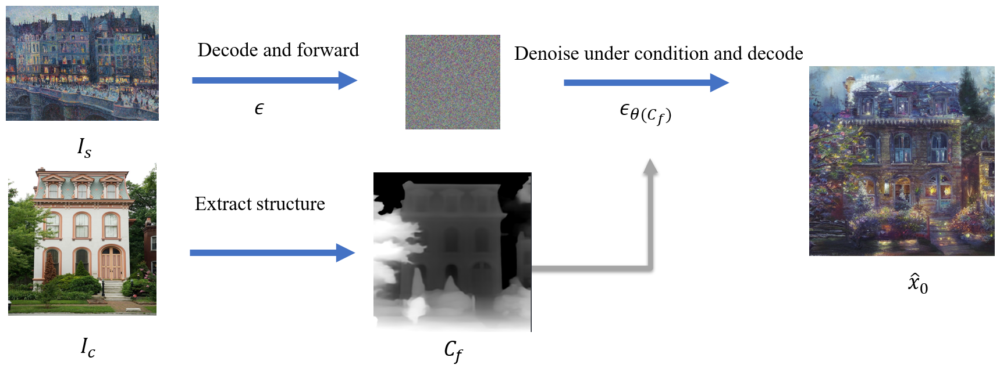
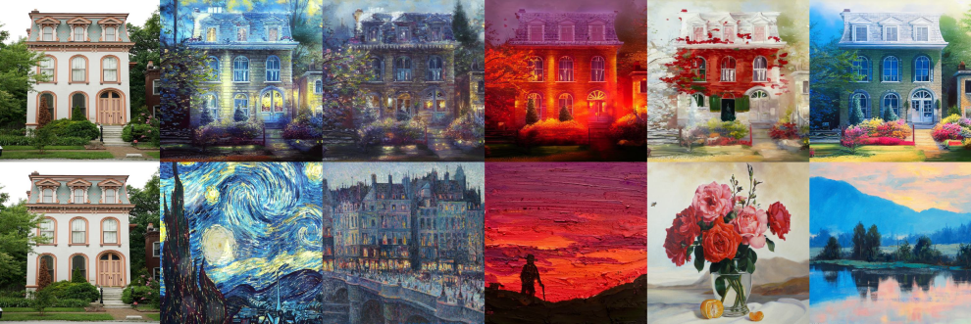
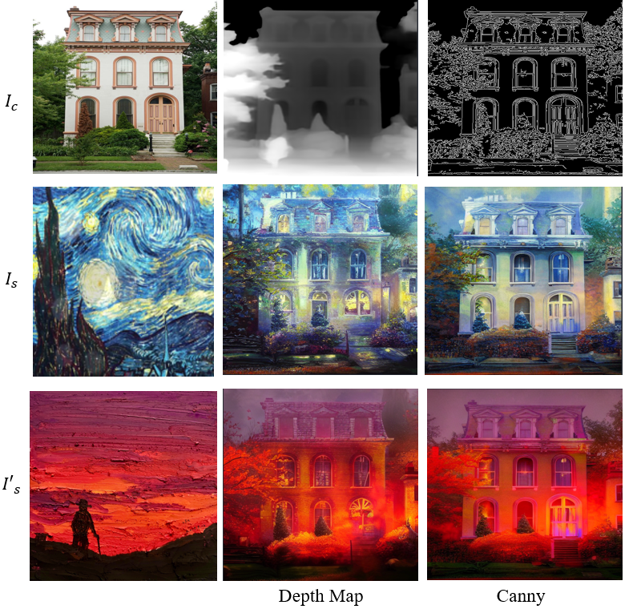
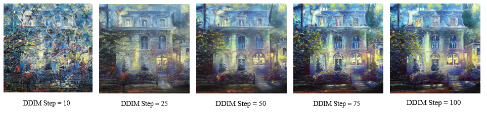

#  Zero-shot method for achieving style transfer
We present a  zero-shot method for achieving style transfer using diffusion-based generative models.
     Leveraging a pre-trained ControlNet, our approach involves a meticulous interplay of forward and reverse processes.
     Additional controls, introduced through interpolation and guided by gradient descent, 
     provide a nuanced means to balance content and style.
# Basic Method 

# Result

# More Control for free using interpolation

The basic method in will ignore the style in the content image $I_c$, which give us less flexibility. Besides, 
increase $F$ will reduce the style of $I_s$ and highlight the structure of $I_c$, which is hard to keep the balance. Thus, we propose another
method to fix the problem by first interpolate the $I_s$ and $I_c$ as in above, then follow the basic method. We can use spherical linear interpolations
or linear interpolation. They have very slight difference, which does not influence the generated images.
The reason behind
the method is that the interpolation help preserve the original structure and the style of $I_c$. If we set $\alpha = 1 $, it will become the basic method 
and if we set $\alpha$ = 0, the $\hat{x_0}$ will contain zero style of $I_s$ and produce the original image $I_c$. This method give us two dimension control. Increasing $\alpha$ will results in 
more style of $I_c$.

# More Control for free using interpolation canny map or depth map as control

# The Effect of DDIM Step
